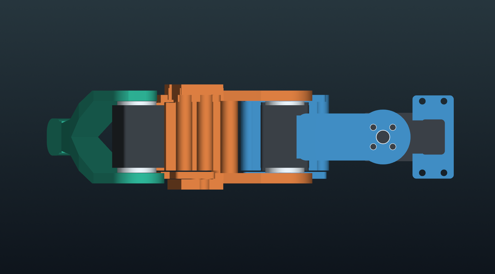
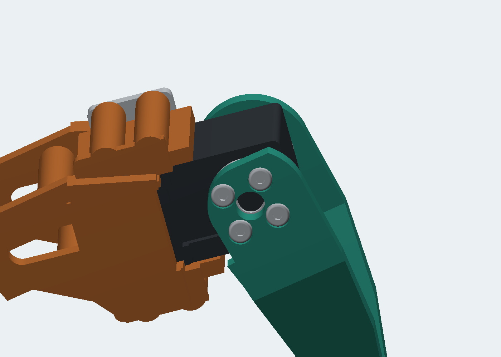

<div align="center">

# ARACHNE / 18

**Six legs. Eighteen actuators. A compact, printable robot with an organic shell.**


**18 × STS3215 12 V** · **3 DoF per leg** · **3S battery bay** · **Onshape + MuJoCo + BAM**

[Explore the Onshape assembly](https://cad.onshape.com/documents/88edbeda4232642329938c14/w/19f5435855c2974f02fa7c68/e/ea6ef29b6f90442d8a9d563b) · [Print & build](docs/build-guide.md) · [Run the simulation](docs/simulation.md) · [Browse the CAD](cad)

</div>

ARACHNE 18 is a six-legged robotics prototype built around eighteen Feetech STS3215 12 V bus servos. A scalloped chassis carries six identical three-axis legs, while a removable dorsal shell conceals a battery tray and a universal controller deck. Paired printed brackets support the supplied metal servo horns on both sides of each joint.

The repository contains editable solid geometry, print-ready meshes, the CadQuery source, assembly guidance, and a working MuJoCo model driven by Better Actuator Models (BAM).

*The hero is AI-assisted presentation artwork. The CAD views and MuJoCo capture below are generated directly from the model. See [image provenance](docs/media.md).*

## At a glance

| | Specification |
|---|---|
| Actuators | 18 × Feetech STS3215 **12 V**, three per leg |
| Mechanism | Six yaw–hip–knee chains; 18 revolute joints |
| Chassis footprint | Approximately 188 × 150 mm, with swept leg-root reliefs |
| Neutral overall envelope | Approximately 374 × 514 × 214 mm |
| Link dimensions | Coxa 50 mm; femur 78 mm; tibia approximately 110 mm |
| Battery space | **115 × 40 × 35 mm**, excluding protruding plugs |
| Power | 3S pack: 11.1 V nominal, 12.6 V fully charged |
| Controller space | **90 × 60 × 18 mm**, on a slotted 108 × 75 mm plate |
| Printed components | 14 unique files; 63 robot pieces, plus a direct-horn fit gauge |
| Hardware in CAD | 262 DIN 7380 M3 screws, 112 ruthex-style inserts, 6 foot locknuts |
| Simulation | 19 rigid links, 18 motors, 499 visual meshes |
| Estimated model mass | 2.346 kg, including assumed battery and hardware |

## Studio portrait


## Look inside

| Serviceable dorsal compartment | Six identical leg modules |
|---|---|
|  |  |

The battery is restrained with two straps. The controller has its own removable deck above it. The shell lifts off after removing four accessible screws. The horns seat directly against equally spaced 5.25 mm printed cheeks; no loose shims or one-sided spacer webs are used. Swept local openings on the dummy side clear the two servo plugs without shifting the leg off the servo centerline.

The mechanical revision uses the owner's **36.5 mm measured outside-to-outside horn span**, with a 36.9 mm inside cheek span, a 7.2 mm shaft-access opening, and 4.0 mm insert bores for ruthex RX-M3x5.7. The outside horn screws are recessed DIN 7380 **M3 × 6**; the other assembly screws and inserts are individual CAD parts. Print the [fit gauge](print/stl/14_direct_horn_fit_gauge.stl) and trial-fit one real servo and both plugs before producing all six legs.



*One-leg orthographic CAD view. The joint cheeks share the same ±23.7 mm outside planes; only the cable relief on the dummy side differs. The paired femur cheeks flare equally at the knee.*

**Horn placement:** the metal horn sits on the **inside** of the printed cheek, against the servo. The outside has four screw heads and a central access hole. Do not mount a metal disc on the outside of the bracket.



The knee detail is generated from the corrected CAD. A bearing-support check samples material beneath all four horn screw heads on each side of the coxa, femur and tibia.

The front and rear pairs can bring their TPU toes together with a **coordinated** yaw, hip and knee motion. Turning two bent legs inward independently can make their knee forks collide; the [joint guide](docs/simulation.md) gives the checked reach pose and its limits.

## Simulate it

Moving to a training computer? Start with the [clone and setup guide](docs/another-computer.md).

Use Python 3.12. From the repository root:

```sh
python3.12 -m venv .venv
source .venv/bin/activate
python -m pip install -r simulation/requirements.txt
python simulation/simulate.py --headless --seconds 10 --voltage 11.1
```

Interactive viewer on macOS:

```sh
mjpython simulation/simulate.py --seconds 300
mjpython simulation/grounded_demo.py --seconds 300
```

On Linux and Windows, use `python` for the viewer. On Windows, activate the environment with `.venv\Scripts\activate`. See the [full simulation guide](docs/simulation.md) for controls, joint frames, custom commands, model regeneration, and troubleshooting.


*Actual floating-base MuJoCo simulation: the body rises and lowers while all six feet keep contact with the ground.*

### Learned walking and a training army

The videos and quoted performance below were recorded before the symmetric-leg CAD revision. The revised MuJoCo model retains the same 18-joint topology; gait, terrain and jump unit tests pass, and the general walking policy completed a five-second BAM smoke run without a fall. The archived performance figures have not yet been remeasured against this revision.

A separate [jump policy and video](https://tom-michiels.github.io/arachne-18/#jump)
maximize clearance beneath every leg and the body, with no upright reward.
The highest recorded jump clears all CAD parts by **2.40 cm**; a second policy
prioritizes consistency across physics timesteps. [Policies and measurements](training/JUMP.md).


The [obstacle videos](https://tom-michiels.github.io/arachne-18/#terrain-pebbles)
now include individual collision stones and passive grass tufts that bend on
contact. Small-stone and short-grass forward examples pass; larger rocks remain
curriculum targets. [Models, curriculum and measured limits](training/OBSTACLES.md).


**[Open the video page — faster walking, all directions and the training army](https://tom-michiels.github.io/arachne-18/)**

The first [walking video](https://tom-michiels.github.io/arachne-18/#fast)
now reaches **29.9 cm/s**, up from 22.4 cm/s: **34% faster**, with **32% greater
foot travel** (6.45 cm versus 4.90 cm) and slightly lower cadence. A broader
smooth foot arc makes the larger steps possible within the original joint limits.
The checkpoint passes **26/26 reference checks**: directions and perturbations
at a 0.24 m/s command, plus fast forward motion at 0.34 m/s. The 20-second
recording includes acceleration and a gentle stop at real simulation time.
[Measurements, operating limits and reproduction](training/SPRINT.md).

A new IMU-aware CEM policy walks in every horizontal direction, turns, follows
curves and stops smoothly. It was trained with the fast local MuJoCo/Metal
simulator and independently checked in the original MuJoCo + BAM model:
**26/26 validation cases pass**, with about **13.3 cm/s** at the normal command
and **19.3 cm/s** at a faster command. The 40-second direction-change demo has
0.084° RMS body tilt and no falls or non-foot ground contacts.

[](assets/arachne-training-army.mp4)

**[Watch the 128-spider training army](assets/arachne-training-army.mp4)** ·
**[Watch walking, direction changes and turning](assets/arachne-learned-omni.mp4)** ·
[Controller, objective, measured results and reproduction](training/README.md)

The army uses real recorded states from distinct training candidates, arranged
for display in independent cells. The solo demonstration uses full BAM physics.
These are simulated gaits; hardware walking has not been validated.

The [uneven-ground curriculum](training/TERRAIN.md) has passed 318 admission
episodes through 4 mm obstacles. It keeps strict body-stability and smoothness
gates, retains flat-ground walking, and stops before unmastered 8 mm obstacles.

**BAM is activated by `simulate.py`. Loading the XML alone does not activate the servo model.** The supplied 12 V M6 parameter set is an approximation fitted to manufacturer torque and speed points, with friction and controller behavior inherited from BAM's identified 7.4 V STS3215 model. It is clearly versioned separately from the original. Read the [model assumptions](docs/bam-model.md) before using it for actuator studies.

## Build it

1. Print the **fit gauge** and one servo clamp. Check a real servo and both supplied horns.
2. Check the measured 36.5 mm horn span, the 2.5/2.0 mm horn thicknesses, the dummy-side plugs, and the shaft clearance against the gauge.
3. Print the structural parts, fit inserts, and build one complete leg.
4. Assemble the six legs, dorsal compartment, electronics, and cable loops.
5. Calibrate servo IDs, encoder offsets, and directions before applying motion.

Start with the [build guide](docs/build-guide.md), [print BOM](print/print_bom.csv), and [hardware BOM](docs/hardware-bom.csv). All individual parts fit the Bambu Lab H2D. STLs use **millimetres** and must be sliced at **100% scale**.

## Repository map

| Path | Contents |
|---|---|
| [`cad/`](cad) | Complete assembly STEP, unique-part STEP layout, individual STEP parts, dimensions and native-name mapping |
| [`print/stl/`](print/stl) | 14 printable parts in bed-oriented poses |
| [`simulation/`](simulation) | MJCF, BAM parameters, runtime, tests, joint map and local-frame meshes |
| [`src/`](src) | CadQuery builder, CAD checks, MuJoCo exporter and rendering source |
| [`docs/`](docs) | Build, simulation, actuator model, Onshape and development guides |
| [`validation/`](validation) | CAD and mesh validation reports |
| [`assets/`](assets) | Studio artwork, CAD renders and simulation media |
| [`licenses/`](licenses) | Third-party license material |

## Validation and project status

The supplied geometry has **14/14 valid single-solid print parts**, **14/14 watertight single-component STLs**, a 1,152-point horn-bearing support check and a CAD check of 262 screw placements and screwdriver routes. Ninety-nine representative leg poses, an 18-pose paired-toe reach path, and 594 nominal connector/straight-exit positions were checked for hard-part interference. MuJoCo tests cover topology, all 18 joint axes, inertia, reset reproducibility, standing at three voltages, and a raised-base joint sweep. See [validation details](docs/validation.md) and the machine-readable reports.

This is a **digitally checked prototype**. The cable sweep uses an estimated plug envelope based on the owner's servo photograph; physical plug fit, flexible cable routing, fatigue, loads and payload still require a one-leg prototype. The runtime includes standing, a grounded body-height exercise and a bench joint sweep; a walking controller is a next development step. The Onshape mating state is recorded separately in [the Onshape guide](docs/onshape.md).

## Sources and attribution

Mechanical dimensions and 12 V operating points come from Feetech documentation. The actuator model builds on [Rhoban/BAM](https://github.com/Rhoban/bam); the simulator uses [MuJoCo](https://github.com/google-deepmind/mujoco). See [sources and third-party notices](THIRD_PARTY_NOTICES.md). No project-wide open-source license has been selected; the included BAM material retains its Apache-2.0 license.
