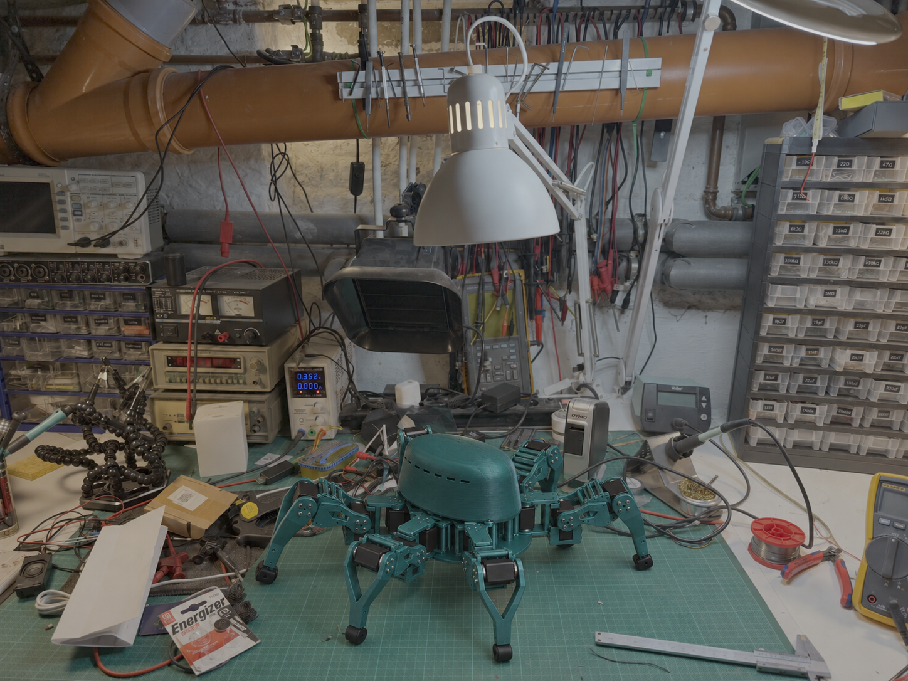
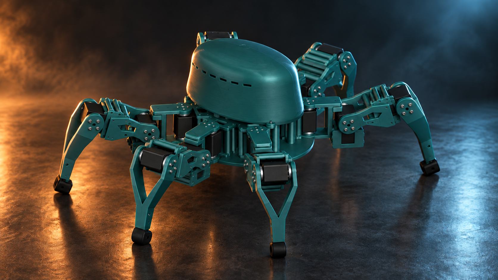
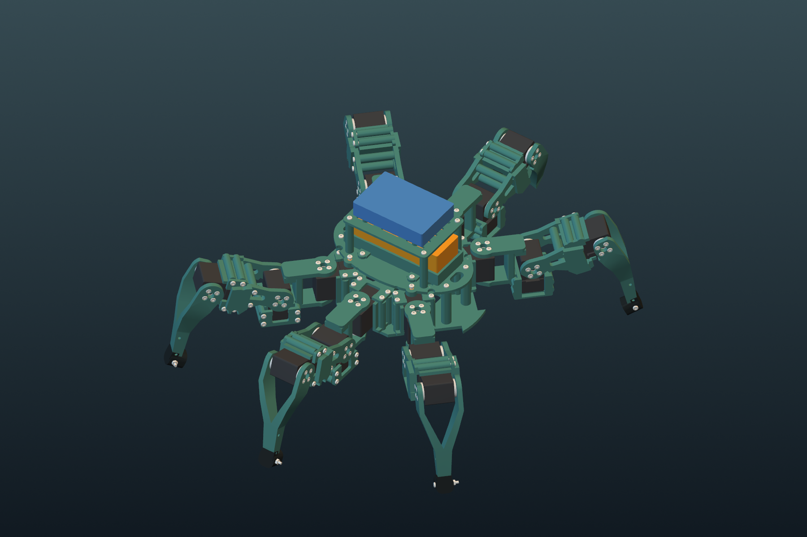
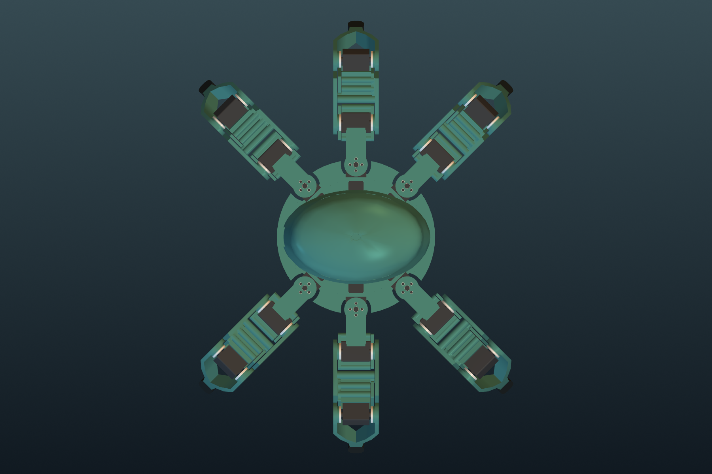
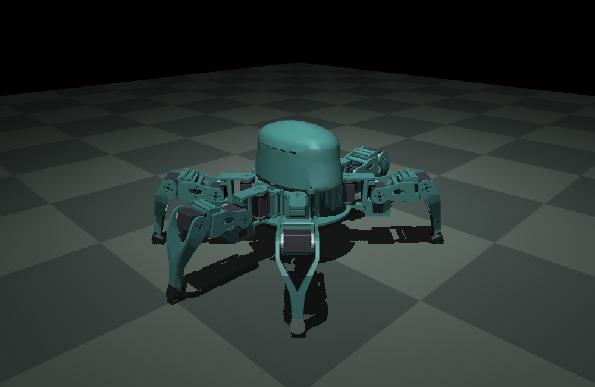
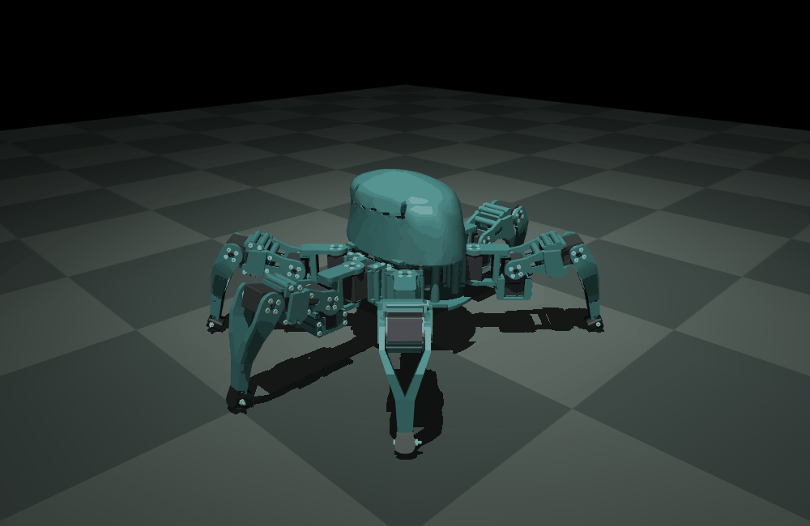
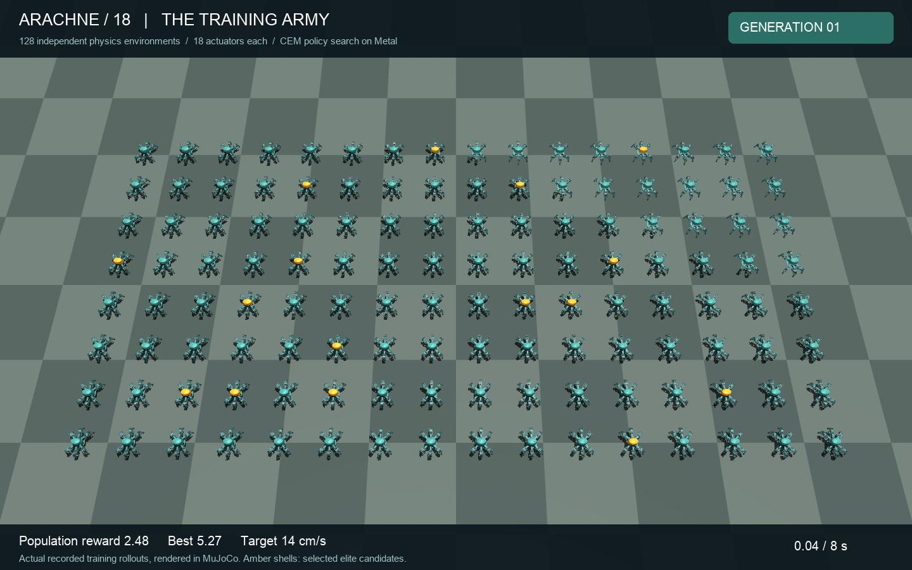

<div align="center">

# ARACHNE / 18

**Six legs. Eighteen actuators. A compact, printable robot with an organic shell.**



**18 × STS3215 12 V** · **3 DoF per leg** · **3S battery bay** · **Onshape + MuJoCo + BAM**

[Explore the Onshape assembly](https://cad.onshape.com/documents/88edbeda4232642329938c14/w/19f5435855c2974f02fa7c68/e/ea6ef29b6f90442d8a9d563b) · [Print & build](docs/build-guide.md) · [Run the simulation](docs/simulation.md) · [Browse the CAD](cad)

</div>

ARACHNE 18 is a six-legged robotics prototype built around eighteen Feetech STS3215 12 V bus servos. A scalloped chassis carries six identical three-axis legs, while a removable dorsal shell conceals a battery tray and a universal controller deck. Paired printed brackets support the supplied metal servo horns on both sides of each joint.

The repository contains editable solid geometry, print-ready meshes, the CadQuery source, assembly guidance, and a working MuJoCo model driven by Better Actuator Models (BAM).

*The hero is AI-assisted presentation artwork. The CAD views and MuJoCo capture below are generated directly from the model. See [image provenance](docs/media.md).*

## At a glance

| | Specification |
|---|---|
| Actuators | 18 × Feetech STS3215 **12 V**, three per leg |
| Mechanism | Six yaw–hip–knee chains; 18 revolute joints |
| Chassis footprint | Approximately 188 × 181 mm |
| Neutral overall envelope | Approximately 374 × 514 × 214 mm |
| Link dimensions | Coxa 50 mm; femur 78 mm; tibia approximately 110 mm |
| Battery space | **115 × 40 × 35 mm**, excluding protruding plugs |
| Power | 3S pack: 11.1 V nominal, 12.6 V fully charged |
| Controller space | **90 × 60 × 18 mm**, on a slotted 108 × 75 mm plate |
| Printed components | 17 unique files; 99 robot pieces, plus a fit gauge |
| Simulation | 19 rigid links, 18 motors, 155 visual meshes |
| Estimated model mass | 2.450 kg, including assumed battery and hardware |

## Studio portrait



## Look inside

| Serviceable dorsal compartment | Six identical leg modules |
|---|---|
|  |  |

The battery is restrained with two straps. The controller has its own removable deck above it. The shell lifts off after removing four accessible screws. Flat cheek plates, removable servo clamps, and separate horn shims make individual legs serviceable.

**Horn placement:** the metal horn sits on the **inside** of the printed cheek, against the servo. The outside has four screw heads and a central access hole. Do not mount a metal disc on the outside of the bracket.

## Simulate it

Moving to a training computer? Start with the [clone and setup guide](docs/another-computer.md).

Use Python 3.12. From the repository root:

```sh
python3.12 -m venv .venv
source .venv/bin/activate
python -m pip install -r simulation/requirements.txt
python simulation/simulate.py --headless --seconds 10 --voltage 11.1
```

Interactive viewer on macOS:

```sh
mjpython simulation/simulate.py --seconds 300
mjpython simulation/grounded_demo.py --seconds 300
```

On Linux and Windows, use `python` for the viewer. On Windows, activate the environment with `.venv\Scripts\activate`. See the [full simulation guide](docs/simulation.md) for controls, joint frames, custom commands, model regeneration, and troubleshooting.





*Actual floating-base MuJoCo simulation: the body rises and lowers while all six feet keep contact with the ground.*

### Learned walking and a training army

**[Open the video page — solo walking and the training army](https://tom-michiels.github.io/arachne-18/)**

A new IMU-aware CEM policy walks in every horizontal direction, turns, follows
curves and stops smoothly. It was trained with the fast local MuJoCo/Metal
simulator and independently checked in the original MuJoCo + BAM model:
**26/26 validation cases pass**, with about **13.3 cm/s** at the normal command
and **19.3 cm/s** at a faster command. The 40-second direction-change demo has
0.084° RMS body tilt and no falls or non-foot ground contacts.

[](assets/arachne-training-army.mp4)

**[Watch the 128-spider training army](assets/arachne-training-army.mp4)** ·
**[Watch walking, direction changes and turning](assets/arachne-learned-omni.mp4)** ·
[Controller, objective, measured results and reproduction](training/README.md)

The army uses real recorded states from distinct training candidates, arranged
for display in independent cells. The solo demonstration uses full BAM physics.
These are simulated gaits; hardware walking has not been validated.

**BAM is activated by `simulate.py`. Loading the XML alone does not activate the servo model.** The supplied 12 V M6 parameter set is an approximation fitted to manufacturer torque and speed points, with friction and controller behavior inherited from BAM's identified 7.4 V STS3215 model. It is clearly versioned separately from the original. Read the [model assumptions](docs/bam-model.md) before using it for actuator studies.

## Build it

1. Print the **fit gauge** and one servo clamp. Check a real servo and both supplied horns.
2. Measure the installed horn-to-horn width and choose the shims.
3. Print the structural parts, fit inserts, and build one complete leg.
4. Assemble the six legs, dorsal compartment, electronics, and cable loops.
5. Calibrate servo IDs, encoder offsets, and directions before applying motion.

Start with the [build guide](docs/build-guide.md), [print BOM](print/print_bom.csv), and [hardware BOM](docs/hardware-bom.csv). All individual parts fit the Bambu Lab H2D. STLs use **millimetres** and must be sliced at **100% scale**.

## Repository map

| Path | Contents |
|---|---|
| [`cad/`](cad) | Complete assembly STEP, unique-part STEP layout, individual STEP parts, dimensions and native-name mapping |
| [`print/stl/`](print/stl) | 17 printable parts in bed-oriented poses |
| [`simulation/`](simulation) | MJCF, BAM parameters, runtime, tests, joint map and local-frame meshes |
| [`src/`](src) | CadQuery builder, CAD checks, MuJoCo exporter and rendering source |
| [`docs/`](docs) | Build, simulation, actuator model, Onshape and development guides |
| [`validation/`](validation) | CAD and mesh validation reports |
| [`assets/`](assets) | Studio artwork, CAD renders and simulation media |
| [`licenses/`](licenses) | Third-party license material |

## Validation and project status

The supplied geometry has **17/17 valid single-solid print parts**, **17/17 watertight single-component STLs**, and no detected neutral-pose CAD overlap above 0.05 mm³. Fifty-four sampled configurations of representative legs were checked for interference. MuJoCo tests cover topology, all 18 joint axes, inertia, reset reproducibility, standing at three voltages, and a raised-base joint sweep. See [validation details](docs/validation.md) and the machine-readable reports.

This is a **digitally checked prototype**. Physical fit, fatigue, loads, cable clearance through a full gait, and physical payload capacity have not been validated. The runtime includes standing, a grounded body-height exercise, a bench joint sweep, and a learned walking controller with independent BAM simulation checks. The Onshape mating state is recorded separately in [the Onshape guide](docs/onshape.md).

## Sources and attribution

Mechanical dimensions and 12 V operating points come from Feetech documentation. The actuator model builds on [Rhoban/BAM](https://github.com/Rhoban/bam); the simulator uses [MuJoCo](https://github.com/google-deepmind/mujoco). See [sources and third-party notices](THIRD_PARTY_NOTICES.md). No project-wide open-source license has been selected; the included BAM material retains its Apache-2.0 license.
