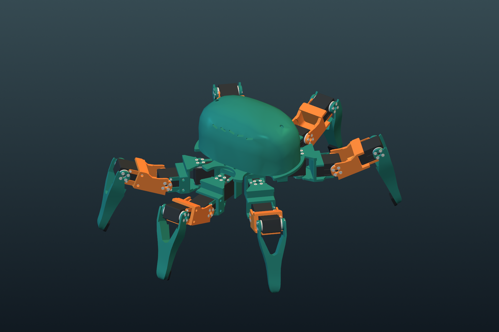
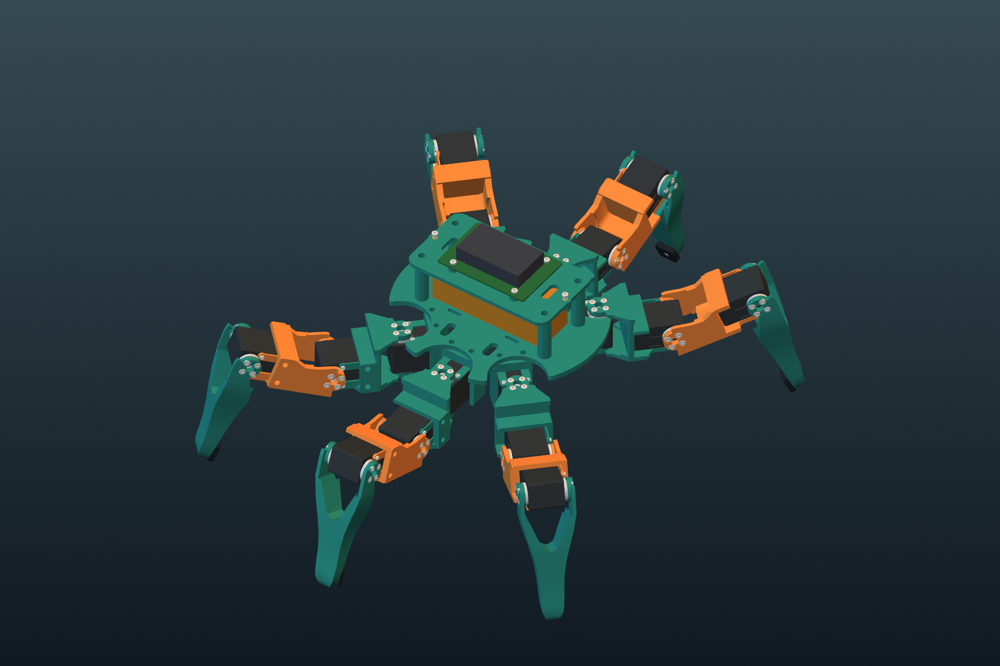
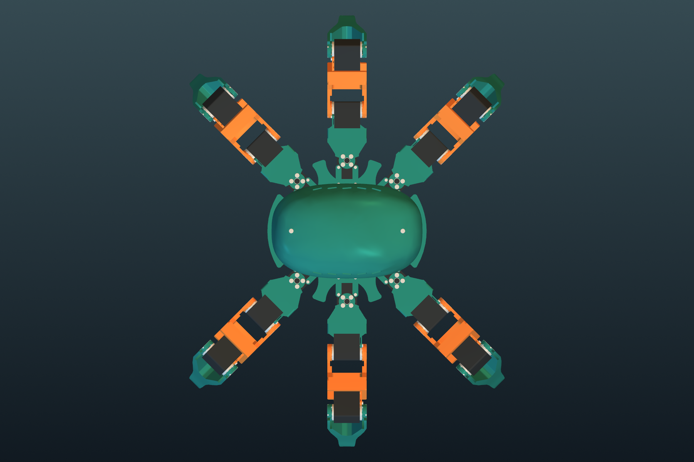
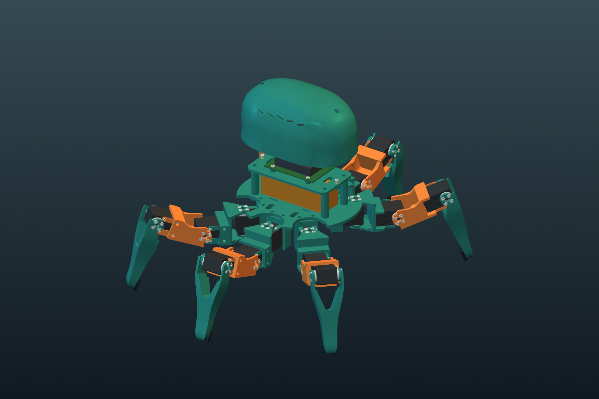
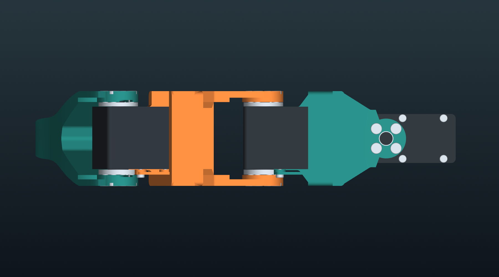
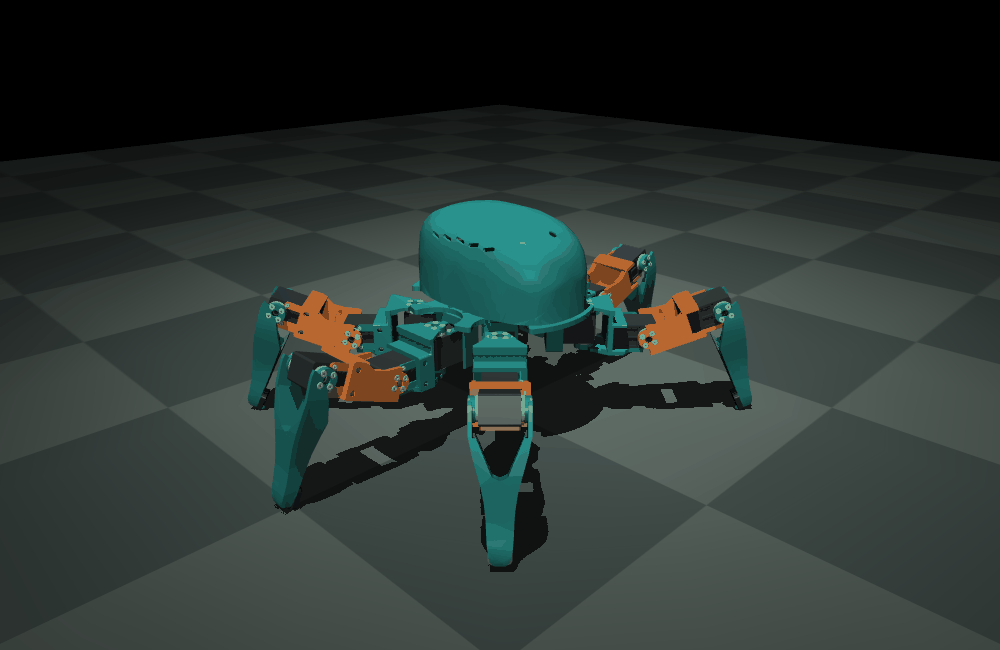

<div align="center">

# ARACHNE / 18 — v4

**Six legs. Eighteen servos. Three monolithic moving links per leg.**



**18 × STS3215 12 V** · **3D printable** · **Onshape** · **MuJoCo + BAM**

[Onshape assembly](https://cad.onshape.com/documents/88edbeda4232642329938c14/w/19f5435855c2974f02fa7c68/e/916e6d95108202647e946643) · [Download print pack](print/ARACHNE_18_v4_print_pack.zip) · [Build guide](docs/build-guide.md) · [Simulation setup](docs/another-computer.md)

</div>

ARACHNE 18 is a compact six-legged prototype built around the owner's eighteen Feetech STS3215 12 V servos. This revision integrates the v4 leg and chassis into the complete robot: a single printed chassis, six identical leg modules, a removable controller carrier, and an organic ventilated canopy.

Each moving link is one printed piece. The tibia is symmetric, the horn cheeks have equal spacing, and the case cradles use the servo's factory mounting points. Local openings on the dummy side provide connector access. Horns sit inside the forks; recessed DIN 7380 button-head screws sit outside. There are no loose structural shims.

| Specification | v4 |
|---|---|
| Mechanism | Six yaw–hip–knee chains; 18 revolute joints |
| Chassis | 194 × 173.5 × 56 mm; six mounts on an 86 mm radius |
| Link geometry | Coxa 62 mm; hip offset −6.95 mm; femur 78 mm |
| Measured horn span | 36.5 mm; driven horn 2.5 mm, dummy horn 2.0 mm |
| Forks | 36.9 mm internal span; 5.5 mm cheeks; Ø7.3 mm center access |
| Battery envelope | 115 × 40 × 35 mm, excluding protruding plugs |
| Controller envelope | 90 × 60 × 18 mm; configurable 64 × 48 mm hole pattern |
| Printed parts | 8 unique files; 31 pieces including 6 TPU shoes and 4 PCB standoffs |
| Modelled hardware | 160 DIN 7380 M3 screws, 72 supplied PA2 case screws, 16 M3 inserts, 36 horns |
| Simulation | 19 rigid links, 18 actuators, 336 visual parts; estimated mass 2.333 kg |

## Inside the robot

| Removable electronics carrier | Symmetric six-leg layout |
|---|---|
|  |  |

The battery rests on the chassis and is retained by two straps. Four integrated posts support the controller carrier. Its mounting screws are reached through deep open wells. Two recessed M3 screws hold the canopy; straight tool openings make them accessible from above. Four small standoffs provide a 6 mm PCB air gap.

The front and rear pairs can touch their toes through a checked coordinated pose: inward yaw approximately 57.51°, hip −20°, knee 0°. This is a reach pose, not a walking command. Independent joint limits do not guarantee arbitrary combinations are collision-free.





## Print and assemble

Download the [STL bundle](print/ARACHNE_18_v4_print_pack.zip), [assembled STEP](cad/ARACHNE_18_assembly.step), or [individual STEP parts](cad/parts). STL units are millimetres; use 100% scale and the supplied orientations. All parts fit the H2D.

Start with one complete leg and a real servo. The [build guide](docs/build-guide.md) explains mounting order, screw lengths, insert positions, connector clearance and support removal. M3 plastic-thread joints use **Ruthex RX-M3x5.7**, with **Ø4.0 × 7 mm pilots**. Horn screws thread into metal horns; supplied case screws thread into the servo's factory mounting points.

The structural pieces have continuous flat bed faces. The curved canopy needs internal support; support is also needed locally beneath some fork bridges. All eight parts were sliced successfully with an A1 geometry proxy profile. **Reslice for your H2D**; no machine-ready G-code is supplied.

## Run MuJoCo

From a fresh clone, with Python 3.12:

```sh
git clone https://github.com/Tom-Michiels/arachne-18.git
cd arachne-18
python3.12 -m venv .venv
source .venv/bin/activate
python -m pip install -r simulation/requirements.txt
python simulation/simulate.py --headless --seconds 10 --voltage 11.1
python simulation/validate.py
```

For an interactive viewer on macOS:

```sh
mjpython simulation/grounded_demo.py --seconds 300
```

Use `python` for the viewer on Linux/Windows. On Windows activate with `.venv\Scripts\activate`. See [setup on another computer](docs/another-computer.md) and the [simulation guide](docs/simulation.md).



The animation is a BAM-driven body-height exercise. All six feet remain in contact; the base is free. The 12 V actuator parameters are an explicitly labelled approximation derived from BAM's identified 7.4 V model and manufacturer operating points. [BAM assumptions](docs/bam-model.md).

## Existing RL work

**No RL retraining was performed for v4.** Existing checkpoints, measurements and walking/jump/terrain videos are preserved. They were produced with earlier geometry and do not establish v4 performance. The training model and inverse kinematics now use v4 dimensions; controller and geometry compatibility tests are included.

[Training documentation](training/README.md) · [Archived locomotion videos](https://tom-michiels.github.io/arachne-18/) · [Revision notes](docs/revision-v4.md)

## Validation and limitations

Eight valid single-solid print parts and eight watertight single-component STLs pass the current checks. The release includes screw/print clearance checks, driver access checks, the isolated leg's factory-hole and connector tests, chassis installation tests, sampled dorsal motion and paired-toe reach evidence. MuJoCo passes topology, joint axes, standing at three voltages, reset reproducibility and grounded motion checks. [Scope and reports](docs/validation.md).

This is a digitally checked prototype. Real servo/horn/plug fit, print tolerances, insert pull-out strength, fatigue and payload capacity need a physical one-leg trial. The controller and battery are envelopes because exact models have not been specified. Servo visuals are simplified exterior references; the original vendor STEP is retained for mechanical checks.

## Files and sources

| Folder | Contents |
|---|---|
| [cad](cad) | Assembly, unique-part layout, individual STEP solids, dimensions and reference geometry |
| [print](print) | Oriented STLs, print quantities and downloadable print pack |
| [simulation](simulation) | MJCF, local-frame meshes, BAM parameters, runtime and validation |
| [src](src) | Parametric CadQuery source, exporters, CAD checks and Onshape mate tooling |
| [docs](docs) | English build, simulation, validation and development guides |
| [training](training) | Updated model adapter and preserved historical RL work |

Actuator modelling uses [Rhoban/BAM](https://github.com/Rhoban/bam); simulation uses [MuJoCo](https://github.com/google-deepmind/mujoco). See [third-party notices](THIRD_PARTY_NOTICES.md). No project-wide open-source license has been selected; bundled BAM material retains its Apache-2.0 license.
