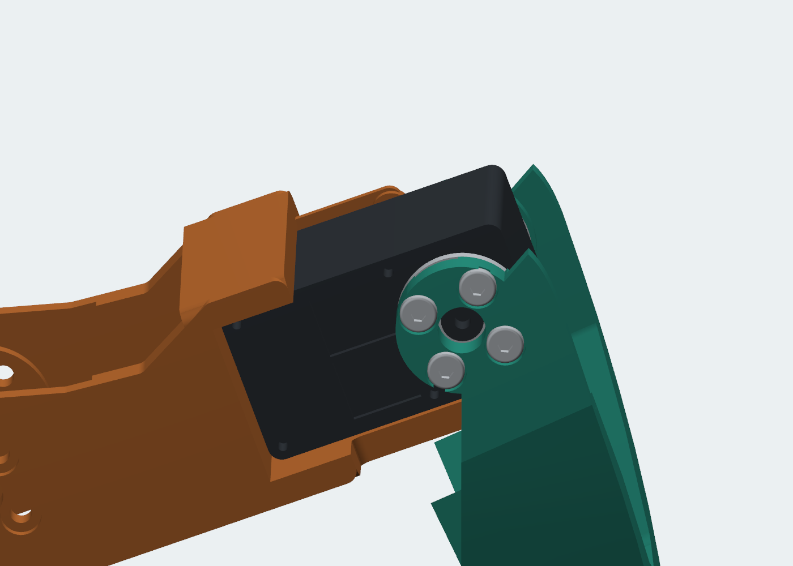

# Building ARACHNE 18 v4

Use the current `print/stl/` files, not earlier revision downloads. Print one leg first. Fit depends on the actual servo, supplied horns, cables, filament shrinkage and printer calibration.

## Print plan

| Part | Quantity | Supplied orientation | Support |
|---|---:|---|---|
| 01_chassis | 1 | Flat dorsal deck on bed; cradles grow upward | Local cradle bridges |
| 02_controller_carrier | 1 | Flat top face on bed; four posts grow upward | Small local recesses |
| 03_organic_canopy | 1 | Open rim on bed | Internal roof and mounting tabs |
| 04_coxa | 6 | Continuous flat underside | Local fork bridge |
| 05_femur | 6 | Continuous flat underside | Local fork bridge |
| 06_tibia | 6 | Continuous flat underside | Local horn bridge |
| 07_tpu_shoe | 6 | Flat sole on bed | None in audit |
| 08_pcb_standoff | 4 | Flat annulus on bed | None in audit |

Use PLA for the first fit trial or a suitably calibrated tougher filament for later structural trials. The geometry audit used a 0.4 mm nozzle, 0.2 mm layers, five walls and 35% gyroid for rigid parts; TPU used 20% infill. Inspect bridge/support placement and layer preview on the H2D. Do not fill screw wells or narrow plug clearances with inaccessible support.

The canopy intentionally remains one removable piece. Its curved roof and internal tabs require support. The A1 proxy estimated about 87 g of canopy support; this is not a support-free part. The other unique rigid parts needed approximately 2–13 g each. These are rough support estimates; reslice on H2D for material and time estimates. No support/G-code settings are certified for a specific H2D material profile.

## Interfaces and screws

- Horn outer span: **36.5 mm** measured by the owner. Driven horn **2.5 mm**, dummy horn **2.0 mm**.
- Fork inside span: **36.9 mm**, providing 0.4 mm total fitting allowance. Both cheeks are **5.5 mm** thick.
- Horns mount **inside** the fork. Eight **DIN 7380 M3×6** screws per joint enter from outside: four per horn.
- Ø6.3 mm head recesses are 1.5 mm deep, leaving 4 mm beneath the head. A 6 mm screw crosses approximately 4.2 mm of cheek/clearance, leaving approximately 1.8 mm in the horn. Confirm engagement and bottoming on the actual horns before tightening.
- Ø7.3 mm center openings clear the measured Ø6.5 mm dummy shaft and allow access to the driven horn's original retaining screw. Shallow inner entry tracks let the shaft slide into the fork.
- Each servo case uses four factory mounting holes, **Ø2.2 mm** through holes and **Ø5.2 mm** head access. Use the supplied PA2 case screws, not M3 machine screws. The CAD assumes a 5 mm under-head length and Ø4 mm head; verify the supplied fasteners.
- Plastic M3 joints use **Ruthex RX-M3x5.7 inserts**. All pilots are **Ø4.0 × 7.0 mm**, with Ø4.5 entry relief. CAD inserts show the nominal installed envelope; thread/knurl detail is simplified.

| M3 joint | Screw | Printed stack to insert | Approx. insert engagement |
|---|---|---:|---:|
| Carrier → chassis | M3×10 | 4 mm | 6 mm to pilot; insert length 5.7 mm |
| Canopy → carrier | M3×10 | 4 mm | 6 mm to pilot; insert length 5.7 mm |
| PCB + standoff → carrier | M3×12 | 1.6 + 6 mm | 4.4 mm |
| TPU shoe → tibia | M3×8 | 2.6 mm | 5.4 mm |

The 7 mm pilot depth provides screw-tip clearance beyond the 5.7 mm insert. Screws must clamp the part before bottoming. Tighten plastic interfaces gently; load capacity has not been physically measured.

## Assemble one leg

1. Remove support and check the flat surfaces, all four holes at every horn and the center shaft opening. Test the real servo and both horns before installing inserts or printing the remaining legs.
2. Remove the horns, slide the hip servo into the coxa cradle from the open dummy side and fasten the driven-side factory case holes with four supplied PA2 screws. Install the knee servo in the femur similarly.
3. Connect/route the bus cables on the **dummy side** while they remain accessible. Leave a service loop at every moving joint. The checked plug/straight-exit envelope is estimated; it is not a model of flexible cable motion.
4. Fit and center the supplied horns on each servo. Slide the femur fork onto the hip horn pair, and the tibia fork onto the knee horn pair, using the shallow dummy-shaft entry track. Fit the recessed M3×6 horn screws from outside. Access the central horn retainer through the center opening.
5. Heat-set one M3 insert into the tibia shoe pilot. Fit the TPU shoe and its M3×8 screw.
6. Sweep the leg slowly by hand/power-limited motion. Check cable bend radii, case screw heads, horn retainers and plugs throughout the intended range. Do not force motion against printed parts or cable tension.

The three structural moving links are monolithic. No side-plate joining screws or structural shims are needed. The tibia is symmetric; only functional dummy-side entry/connector details make the other links locally asymmetric.

## Chassis and dorsal compartment

1. Fit four inserts in the chassis at X=±64, Y=±25 mm. Fit six inserts in the carrier: four PCB positions at X=±32, Y=±24, and two cover positions at X=±68, Y=0.
2. Insert the six yaw servos into the chassis from below with horns removed. Secure each with four supplied case screws. The dummy face and its connectors face down. Attach the coxa forks to the horn pairs using the same M3×6 interfaces as the other joints.
3. Run two battery straps through the 14×3.5 mm slots at X=±30, Y=±25. The underside route is clear at Z≈20 mm. Fit a protective pad and the battery; allow additional room for leads and connector strain relief.
4. Lower the carrier onto the four chassis bosses. Install four M3×10 screws through its open access wells using a slim **2 mm hex driver** with at least 50 mm usable reach. The screw heads seat near the bottoms of the wells.
5. Install the controller using four 6 mm standoffs and M3×12 screws. The reference PCB is 90×60×1.6 mm with 64×48 mm mounting pitch. Adapt `PCB_MOUNTS` in `src/v4_dorsal.py` to the actual board before printing. Extra slots support alternative mounting arrangements; check that they clear components and underside solder joints.
6. Route leads through the carrier slots and rear canopy opening. Lower the canopy and fasten its two M3×10 screws through the top driver openings. The canopy can be removed without disturbing the legs or carrier.

Battery space is 115×40×35 mm and controller space is 90×60×18 mm. These are nominal envelopes, not endorsements of a specific pack/board. The intended source is a 3S battery (11.1 V nominal, 12.6 V full) for the 12 V servo variant. Power distribution, fuse, connector current rating and logic-voltage regulation remain controller/pack-specific electrical design work.

## Commissioning

Assign IDs 1–18 using `simulation/joint_map.json`, verify each servo's sign and center, and start with one unloaded leg at limited speed/current. CAD joint ranges are geometric limits, not verified hardware travel. Stand tests use much smaller motion. Confirm physical fit, rigidity, insert retention and cable clearance before attempting load-bearing walking.
